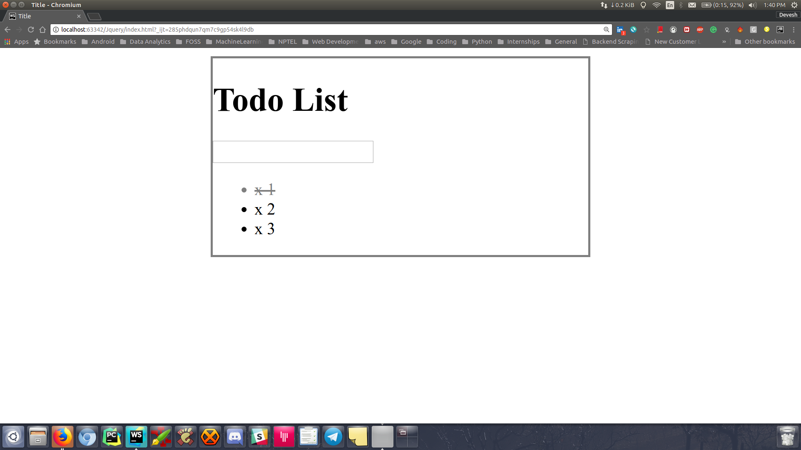

# jQueryTodo-List

###Giving basic strike out and revert back functionality

* Basic look of the page 

* The code below provide the basic strike through and back to normal functionality.

```js
// Check off specific todos by clicking
$("li").click(function () {
    //if it is grey
    if ($(this).css("color") === "rgb(128, 128, 128)"){
        //then turn it black
        $(this).css({
            color: "black",
            textDecoration: "none"
        });
    }
    //else
    else{
        //turn this grey
        $(this).css({
            color: "grey",
            textDecoration: "line-through"
        });
    }
    
    //  $(.this).css("text-decoration", "line-through");
    // we can write "text-decoration" when we are making an object
    // we need to make use of camel-case as used above
});
```
* The code above can be replaced with the code below by making use of `toggleClass()` and adding a 
  class `completed` to `todos.css`
```css
.completed {
    color: grey;
    text-decoration: line-through;
}
```
* Update the code in `todos.js` as below.
```js
//function 1
$("li").click(function () {
   $(this).toggleClass("completed")
});
```



* Now when we need to give `delete functionality`. To do so below is the JS code.

```js
//function 2
// click on X to delete todo
$("span").click(function () {
   alert("clicked in span")
});
```
* The problem with above code is that when we click on `X` to delete the todo the `function 1` is executed 
  automatically.
* This is known as bubbling effect.

* This screenshot displays the same.


* In order to stop this effect we need to add an event listener to the span function i.e `function 2`.
* `event.stopPropagation` stops from any executing any other events on parent elements.

```js
$("span").click(function (event) {
   alert("clicked in span");
    event.stopPropagation()
});
```


* Complete code to delete the todo when X is clicked.
```js
$("span").click(function (event) {
   $(this).parent().fadeOut(500, function () {
       $(this).remove();
   });
    event.stopPropagation()
});
```

<p>
  
</p>


* New step is to enable the functionality to add todo to list.

```js
//Adding todo to list
$("input[type='text']").keypress(function (event) {
    if (event.which === 13){
        //grabbing new todo text from input
        var todotext = $(this).val();
        //create a new <li> and add to <ul>
        $("ul").append("<li>"+todotext+"</li >")
    }
});
```
* But this has a major issue, because after adding the todo to the list the text still exists 
  in the input text box.
  
<p align="center">
  
</p>

* In order to remove the input text from the box after adding it to the todo list, update the code as follows:

```js
$("input[type='text']").keypress(function (event) {
    if (event.which === 13){
        //grabbing new todo text from input
        var todotext = $(this).val();
        //To clear the input text from the input box
        $(this).val("");
        //create a new <li> and add to <ul>
        $("ul").append("<li><span>X</span> "+todotext+"</li >")
    }
});
```
<p align="center">
  
</p>

* One major issue with above code is that when we add new todo's the strike out and deletion functionaltity dont work.

<p align="center">
  
</p>

##### THIS IS BECAUSE OF THE FACT THAT BOTH click() AND on() GET THE WORK DONE BUT click() ADDS LISTENERS TO ONLY PRE EXISTING ELEMENTS NOT WITH THE NEWLY CREATED ONES.

##### TO GET RID OF THIS ERROR WE NEED TO DO THE FOLLOWING CHANGES

* The reason we need to add a listener using jQuery on elements is that exist when this code is run for the first time.
  And when this code runs for the first time we do not have all the <li> instead we have <ul> which contains all the <li>.

```js
//function 1
$("ul").on("click","li", function(){
   $(this).toggleClass("completed")
});

//function 2
$("ul").on("click", "span" ,function (event) {
   $(this).parent().fadeOut(500, function () {
       // the above this refers to the span and .parent() makes it
       // work with the parent i.e <li>.
       // the fadeOut() is also working on parent <li> not on span
       $(this).remove();
       // $(this).remove(); is working on parent element not the span.
   });
    event.stopPropagation()
});
```

* The above code `$("ul").on("click","li", function(){` and `$("ul").on("click", "span" ,function (event) {` add a listener to entire `<ul>` parent.

* The `<li>` in the above line tell that whenever an `<li>` is clicked inside `<ul>` run the function, same is with `function 2`

<p align="center">
  
</p>

