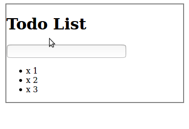

# jQueryTodo-List

###Giving basic strike out and revert back functionality

* Basic look of the page 

* The code below provide the basic strike through and back to normal functionality.

```js
// Check off specific todos by clicking
$("li").click(function () {
    //if it is grey
    if ($(this).css("color") === "rgb(128, 128, 128)"){
        //then turn it black
        $(this).css({
            color: "black",
            textDecoration: "none"
        });
    }
    //else
    else{
        //turn this grey
        $(this).css({
            color: "grey",
            textDecoration: "line-through"
        });
    }
    
    //  $(.this).css("text-decoration", "line-through");
    // we can write "text-decoration" when we are making an object
    // we need to make use of camel-case as used above
});
```
* The code above can be replaced with the code below by making use of `toggleClass()` and adding a 
  class `completed` to `todos.css`
```css
.completed {
    color: grey;
    text-decoration: line-through;
}
```
* Update the code in `todos.js` as below.
```js
//function 1
$("li").click(function () {
   $(this).toggleClass("completed")
});
```


* Now when we need to give `delete functionality`. To do so below is the JS code.

```js
//function 2
// click on X to delete todo
$("span").click(function () {
   alert("clicked in span")
});
```
* The problem with above code is that when we click on `X` to delete the todo the `function 1` is executed 
  automatically.
* This is known as bubbling effect.

* This screenshot displays the same.


* In order to stop this effect we need to add an event listener to the span function i.e `function 2`.
* `event.stopPropagation` stops from any executing any other events on parent elements.

```js
$("span").click(function (event) {
   alert("clicked in span");
    event.stopPropagation()
});
```


* Complete code to delete the todo when X is clicked.
```js
$("span").click(function (event) {
   $(this).parent().fadeOut(500, function () {
       $(this).remove();
   });
    event.stopPropagation()
});
```

